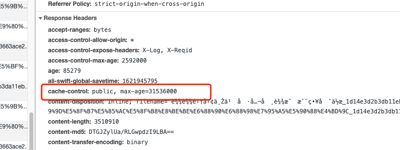
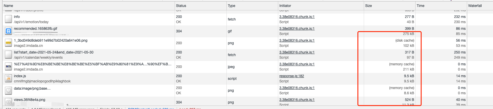
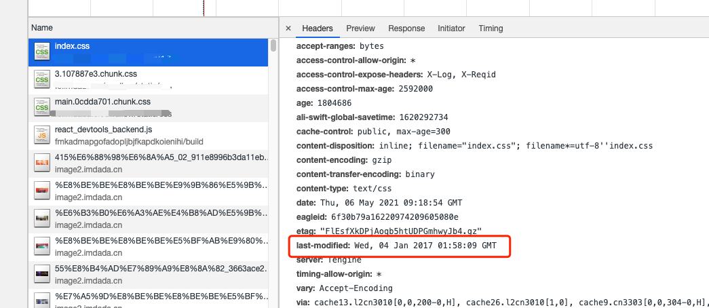
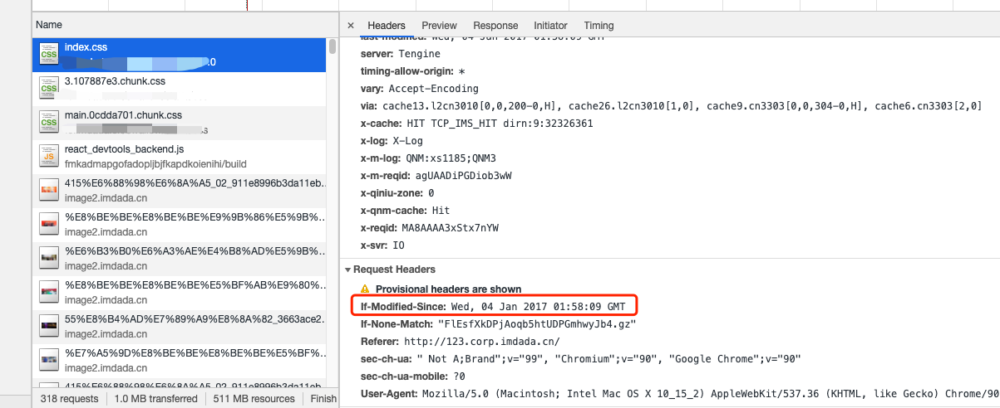
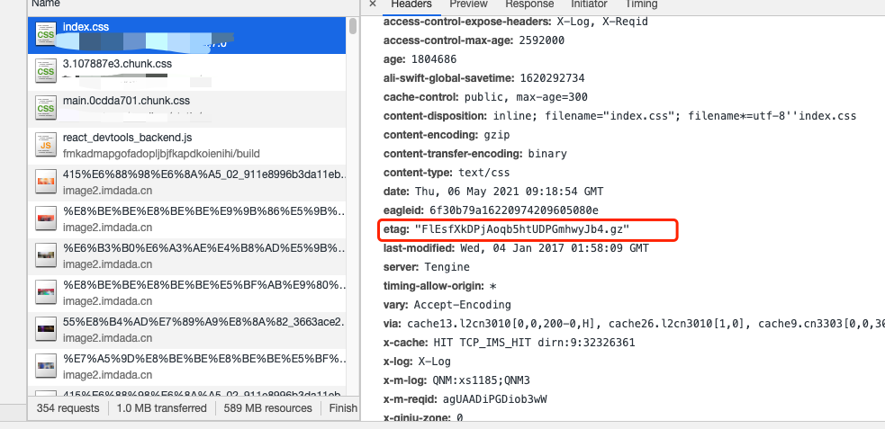
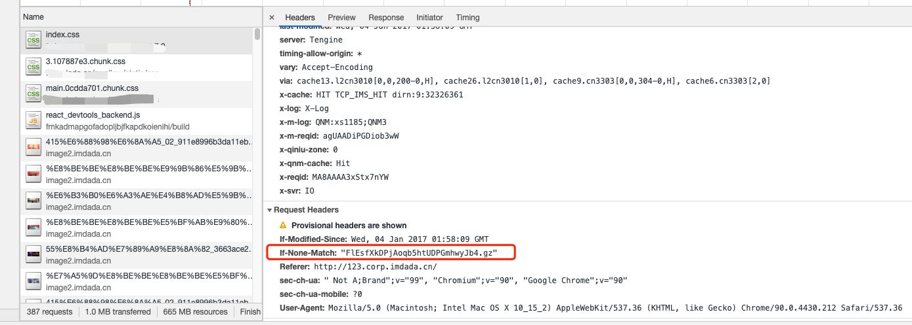

# 浏览器缓存机制
浏览器缓存是性能优化中的重要一环，对于前端而言重要性不言而喻。
## 缓存过程分析
浏览器与服务器之间的通信的方式为应答模式，既是：浏览器发起HTTP请求-服务器响应请求。那么在浏览器第一次向服务器发起请求拿到请求结果，会根据响应报文中HTTP头的缓存标识，决定是否缓存结果，是则将请求结果和缓存标识存入浏览器缓存中，简单的过程如下图：

>可以看到：
* 浏览器每次发起请求之前都会先去浏览器缓存中查找改请求的结果以及缓存标识，有缓存结果并且校验没有过期时会直接从浏览器取数据，否则再去服务器请求。
* 浏览器每次从服务器拿到返回结果都会根据响应报文将该结果和缓存标识存入到浏览器缓存中。
以上两点的结论就是浏览器缓存机制的关键，他确保了每次请求的存入和读取。只要我们再理解浏览器缓存的使用规则，那么所有的问题都清楚了。下面根据是否需要向浏览器重新发起HTTP请求将缓存分为两个部分，分别是强制缓存和协商缓存。
### 强制缓存
强制缓存就是向浏览器缓存查找该请求结果，并根据该结果的缓存规则来决定是否使用该缓存结果的过程，强制缓存的情况主要有3种，如下：
* 不存在该缓存结果和缓存标识，强制缓存失败，则直接向服务器发起请求，如下图：

* 存在该缓存结果和缓存标识，但该结果已失效，强制缓存失效，则使用协商缓存，如下图：

* 存在缓存结果和缓存标识，且该结果尚未失效，强制缓存生效，直接返回结果，如图：

>那么，强制缓存的缓存规则是什么？
当浏览器向服务器发起请求时，服务器会将缓存规则放入HTTP响应报文的HTTP头和请求结果一起返回给浏览器，控制强制缓存的字段分别是Expires和Cache-Control，其中Cache-Control优先级比Expires高。
### Expires
Expires是HTTP/1.0控制网页缓存的字段，表示浏览器返回该请求的结果的到期时间，即再次发起该请求时，如果客户端的时间小于Expires的值时，直接使用缓存结果。
浏览器默认使用的是HTTP/1.1，Expire已经被Cache-Control替代，原因在于Expires控制缓存的原理使用的是客户端的时间和服务器返回的时间做对比，那么如果客户端与服务端的时间因为某些原因发生误差，强制缓存则会直接失败，这样的话强制缓存的存在则毫无意义，那么Cache-Control又是如何控制的呢？
### Cache-Control
在HTTP/1.1中，Cache-Control是其中一个重要的规则，用于控制网页缓存，主要取值为：
* public：所有内容都将被缓存（客户端和代理服务器都可缓存）
* private：所有内容只有客户端可以缓存，Cache-Control的默认值
* no-cache：客户端缓存内容，但是否使用缓存则需要经过协商缓存来验证决定
* no-store：所有内容都不会被缓存，即不使用强制缓存，也不使用协商缓存
* max-age=***：缓存内容将在***秒后失效

意思是在31536000秒内如果再次发起请求就直接使用缓存结果，强制缓存生效。
>那么浏览器的缓存存放在哪里，如何在浏览器中判断强制缓存是否生效？

从图中可以看到状态吗为灰色的表示使用了强制缓存，请求对应的size值则代表该缓存存放的位置，分别为from memory cache和from disk cache。
>那么memory cache和disk cache分别是什么意思？什么时候使用memory cache，什么时候使用disk cache呢？

memory cache代表使用内存中的缓存，disk cache代表使用硬盘中的缓存，浏览器读取缓存的顺序为memory -> disk
首先我们先了解一下内存缓存和硬盘缓存的区别，如下：
* 内存缓存（memory cache）：内存缓存具有两个特点，分别是快速读取和时效性。
快速读取：内存缓存会将编译解析后的文件，直接存入该进程的内存中，占用该进程一定的内存资源，以方便下次运行使用时快速读取。
时效性：一旦该进程关闭，进程内存将被清空释放。
* 硬盘缓存（disk cache）：硬盘缓存则直接将缓存写入硬盘文件中，读取缓存需要对该缓存存放的硬盘文件进行I/O操作，然后重新解析该缓存内容，读取复杂。速度比内存缓存慢。
在浏览器中，浏览器会在js和图片等文件解析执行后直接存入内存缓存中，那么当刷新页面时只需直接从内存缓存中读取(from memory cache)；而css文件则会存入硬盘文件中，所以每次渲染页面都需要从硬盘读取缓存(from disk cache)。

### 协商缓存
协商缓存就是强制缓存失效后，浏览器携带缓存标识向服务器发起请求，由服务器根据缓存标识决定是否使用缓存的过程，主要有以下两种情况：
协商缓存生效，返回304，如下：

协商缓存失效，返回200和请求结果，如图：

同样，协商缓存的标识也是在响应报文的HTTP头中和请求结果一起返回给浏览器的，控制协商缓存的字段分别有：Last-Modified / If-Modified-Since和Etag / If-None-Match，其中Etag / If-None-Match的优先级比Last-Modified / If-Modified-Since高。

#### Last-Modified / If-Modified-Since
Last-Modified是服务器响应请求时，返回该资源文件在服务器最后被修改的时间，如下。

If-Modified-Since则是客户端再次发起该请求时，携带上次请求返回的Last-Modified值，通过此字段值告诉服务器该资源上次请求返回的最后被修改时间。服务器收到该请求，发现请求头含有If-Modified-Since字段，则会根据If-Modified-Since的字段值与该资源在服务器的最后被修改时间做对比，若服务器的资源最后被修改时间大于If-Modified-Since的字段值，则重新返回资源，状态码为200；否则则返回304，代表资源无更新，可继续使用缓存文件，如下。

#### Etag / If-None-Match

Etag是服务器响应请求时，返回当前资源文件的一个唯一标识(由服务器生成)，如下:

If-None-Match是客户端再次发起该请求时，携带上次请求返回的唯一标识Etag值，通过此字段值告诉服务器该资源上次请求返回的唯一标识值。服务器收到该请求后，发现该请求头中含有If-None-Match，则会根据If-None-Match的字段值与该资源在服务器的Etag值做对比，一致则返回304，代表资源无更新，继续使用缓存文件；不一致则重新返回资源文件，状态码为200，如下。

 
### 总结
强制缓存优先于协商缓存进行，若强制缓存(Expires和Cache-Control)生效则直接使用缓存，若不生效则进行协商缓存(Last-Modified / If-Modified-Since和Etag / If-None-Match)，协商缓存由服务器决定是否使用缓存，若协商缓存失效，那么代表该请求的缓存失效，重新获取请求结果，再存入浏览器缓存中；生效则返回304，继续使用缓存，主要过程如下：

