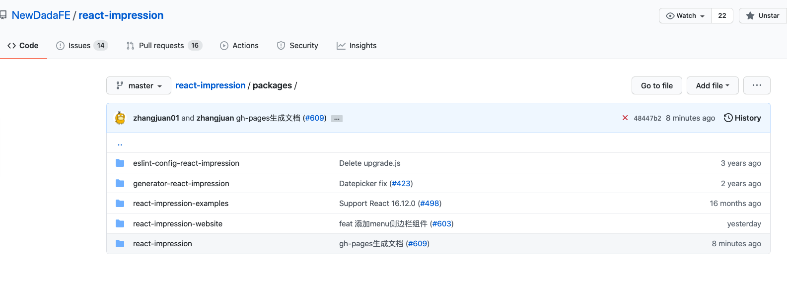
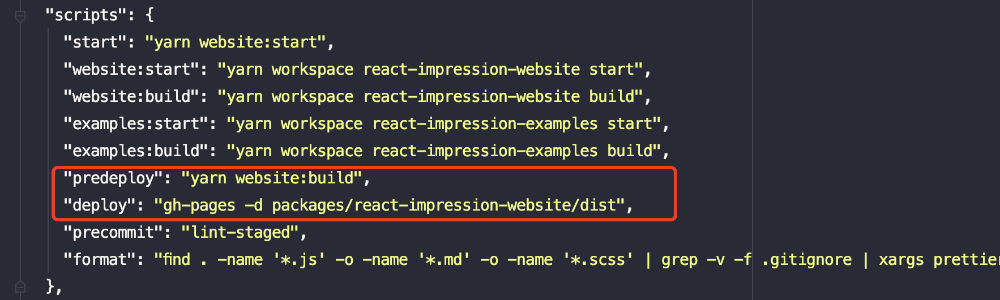
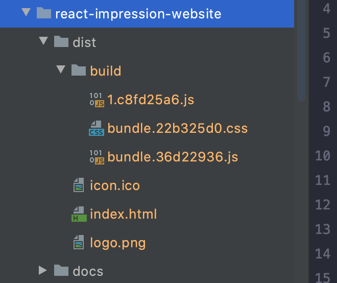
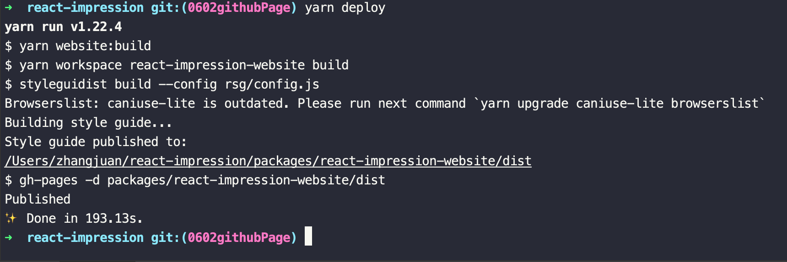
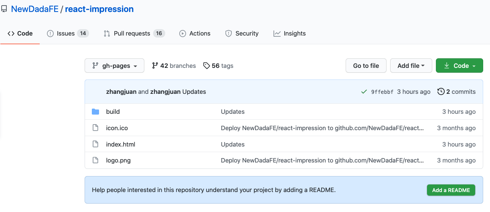
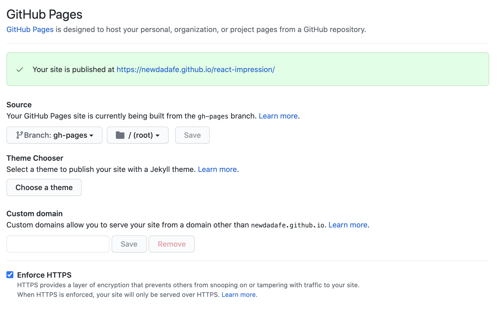

# gh-pages介绍与使用
  ### gh-pages介绍
  gh-pages是用来在github上发布文件到gh-pages分支上
  
  ### 使用场景
  有些时候一个代码仓库存在多个项目，我们要使用github page生成其中一个项目的文档，这个时候就需要借助github的工具[gh-pages](https://www.npmjs.com/package/gh-pages)
  去生成一个新的分支gh-pages，根据这个分支去生成github pages网站。
  以我司组件库代码为例：
  
  
  里面共五个项目，其中react-impression为组件库代码，react-impression-website为组件库文档以及示例说明，我只想基于react-impression-website生成文档的网站，就可以借助gh-pages插件来实现。
  步骤如下：
  1. 执行安装gh-pages：
    `npm install gh-pages --save-dev`
  2. 修改package.json文件中命令：
  
  
  
  实际执行`yarn deploy`之前先执行了`yarn predeploy`，也就是执行的build打包命令，会在react-impression-website下生成打包后文件dist
   
   
   `yarn deploy`则是将路径`packages/react-impression-website/dist`下的文件上传到github仓库的gh-pages分支上。
   
   发布成功就可以看到github上更新：
   
  3. 执行`yarn deploy`，手动发送文件到ph-pages分支：`yarn deploy`
  4. 配置项目setting中pages选项：
  
 
 
 