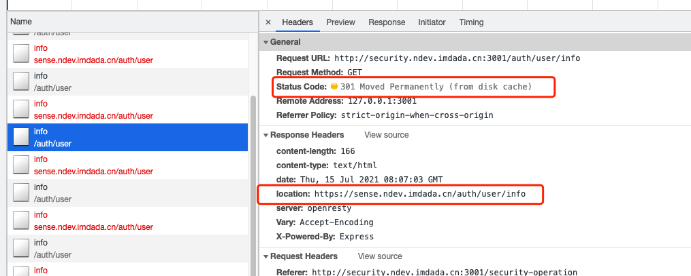
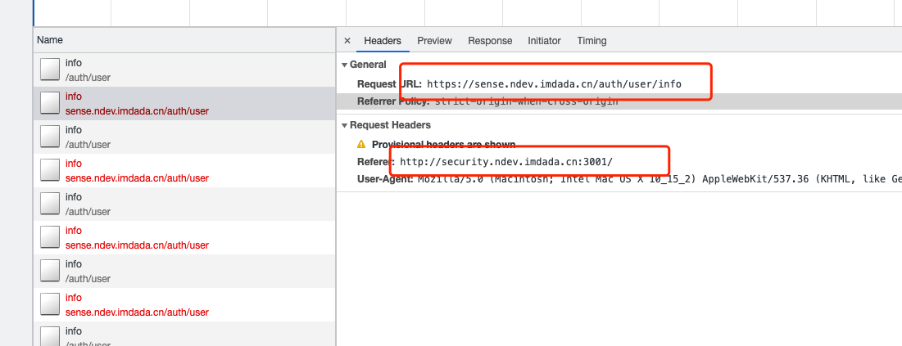
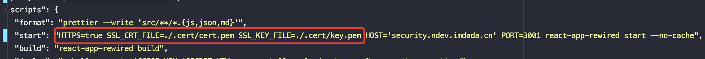
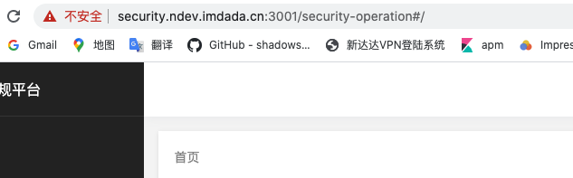

# 如何在本地用https起项目

事情的起因是这样，某天同事突然找我求助，说项目啥也没动，但是本地起项目一直在重复刷新重定向，不晓得怎么回事，让我帮忙看看，如下图：
 
 
 
 聪明的我很快发现了端倪，请求被永久重定向到了https，由于我之前没有遇到过这个问题，所以猜测可能是http代理到https出现了问题，
 我直接从测试环境打开http的链接也还是跳转到https，想验证这个问题，就要在本地用https起项目。谷歌了一通，需要在本地使用OpenSSL
 生成根SSL证书以及域SSL证书，信任证书使用证书等等一堆步骤，看着就头大，虽然最后能解决问题，但程序员的直觉告诉我，这肯定不是最优解。
 ### Mkcert
 官方的解释就一句话："Create self signed tls certificates without OpenSSL."，意思是能帮我们自动创建tls证书，再也不需要OpenSSL了。
 步骤如下：
 ```js
 # Install mkcert tool
 brew install mkcert
 # install nss （如果不需要在Firefox上调试忽略这步）
 brew install nss
 # Setups mkcert on your machine
 mkcert  -install
 ```
 经过以上步骤，将在你的计算机上创建一个证书颁发机构，可以为以后所有的项目生成证书。
 然后在你要启动的项目的根目录运行：
 ```js
# Create .cert directory if it doesn't exist
mkdir -p .cert

# Generate the certificate (ran from the root of this project)
mkcert -key-file ./.cert/key.pem -cert-file ./.cert/cert.pem "localhost"
```
这部会把生成的证书存储在.cert目录中。这些不应该提交给版本控制，所以要在项目的.gitignore里面加上.cert，忽略此证书文件。
接下来在我们的项目更新package.json脚本，以https启动我们的项目，并且包含刚刚创建的证书。

再次执行yarn start重启项目，可以看到项目正常运行，至此也验证了我们的猜测，就是http代理到https导致的无限刷新重定向。


那为什么之前好好的，现在不行了？猜测可能是运维改动了，后来联系了我们运维小哥，发现他之前配值http白名单的时候把我们的项目配错了，改成了永久重定向到https才会导致的这个问题，又帮我们改回去了，至此完美解决。
> 总结：帮别人解决问题的同时，自己也收获了知识，这感觉非常的好，愿大家能共同成长。

